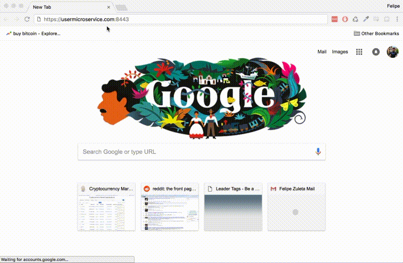

# Sample-User-Microservices

## What is this?

This is a fully running `client/server` implementation for a user management tool (requires a user to login to load a dashboard), with dev goals for:
1. Scalable
2. Easy to deploy
3. Same environment for Dev|Prod
4. Concise

## Technology:
- **Sever**: Kotlin, Java, Jetty, Redis, Apache Shiro, AES encryption, Vert.X messaging (with ssl).
- **Client**: Aurelia.io, Typescript. (mobile friendly css)

## Features:
- Login (with remember me)
- Captchas
- Google Analytics
- Multi-Language (EN/ES), scalable to n amount of languages.
- Registration
- Confirm email
- Forgot password
- Two factor authentication (enable | disable | recovery codes)
- Guest account
- Client/Server ssl communication
- Server microservices communication using ssl

## To Run #
1. add to `etc/hosts`
    - `127.0.0.1 usermicroservice.com`
2. `cd ./server` 
3. `./gradlew build jar`
4. `cd ..`
4. `docker-compose up --build`
5. open: `https://usermicroservice.com:8443` 
6. in chrome accept private certificate.

- You can always run with intelliJ by either running each module, or as a configuration.

## Future Recomendations:
- Implement apache kafka as an event store.
- Implement each future microservice with it's own read-store.

### when adding new microservices
update self.keystore in `resources` and add a new `dns:XXXXXXXX` and build and run again the docker images.

    keytool -keystore self.keystore -alias localhost -validity 3650 -genkey -keyalg RSA -sigalg SHA256withRSA -ext san=dns:localhost,dns:usermicroservice.com,dns:apigateway,dns:members,dns:webserver,dns:contact

# Disclaimer
All code provided in this git repository is experimental, and should not be used as-is in production.
- Always change all passwords stored in the docker-compose.yml, or source code. this passwords are only for dev-testing.
- create your own SSL certificates, ideally signed by a CA.
- must not be used as-is in production
- must not be used as-is in production
- must not be used as-is in production
- See the LICENSE file for more info

if you do use it in prod... well.. I told you not to. :)